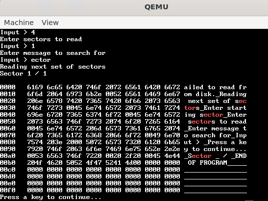

+++
title = "Assembly Project"

[taxonomies]
tags = ["asm", "University"]

[extra]
date = "2023"
img = "icon.png"
+++

A university assessment piece about creating a [hex reader](https://en.wikipedia.org/wiki/Hex_editor)
using assembly code. This was my first time using assembly code and scored 86/100 marks.

I've included the code below.

<figure>
  
  <figcaption>
    Screenshot of the final product viewing the end of it's code own in memory while higlighting
    all instances of 'ector'
  </figcaption>
</figure>

 

## Project Code

Makefile and pearl script used to build program. Both provided by the university.

{{ collapsible(text='Toggle "Makefile') }}
{{ embed_code_block(language="", path="content/projects/asm/code/Makefile") }}

{{ collapsible(text='Toggle "sign.pl') }}
{{ embed_code_block(language="", path="content/projects/asm/code/sign.pl") }}

First bootloader stage. Some of this file was provided as a starting point/template however most of the
implemented functionality (read from disk, cons_write, checking disk) and formatting is mine.

{{ collapsible(text='Toggle "bootasm.S') }}
{{ embed_code_block(language="asm", path="content/projects/asm/code/bootasm.S") }}

Main bulk of the code. This is all my own work.

{{ collapsible(text='Toggle "bootasm2.S') }}
{{ embed_code_block(language="asm", path="content/projects/asm/code/bootasm2.S") }}

...

 

## Project Log (pdf)

<object data="Log.pdf" type="application/pdf" width="700px" height="700px">
    <embed src="Log.pdf">
        
This browser does not support PDFs. Find the link here: <a href="Log.pdf">PDF LINK</a>.

    </embed>
</object>
