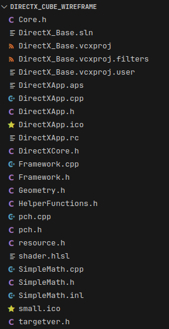
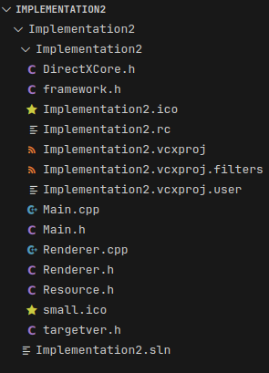
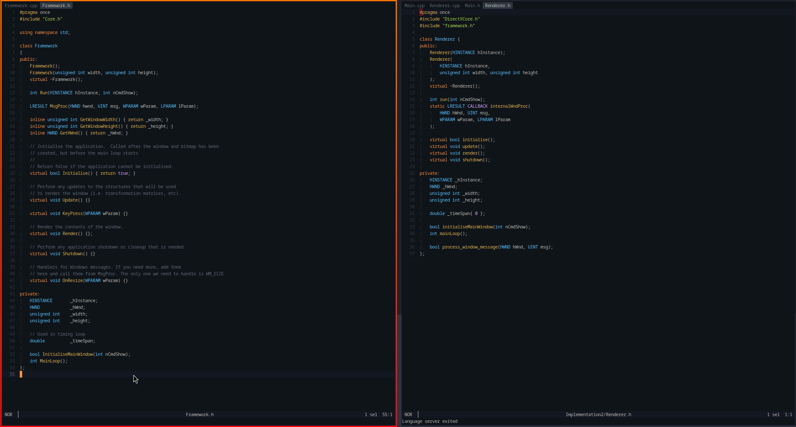
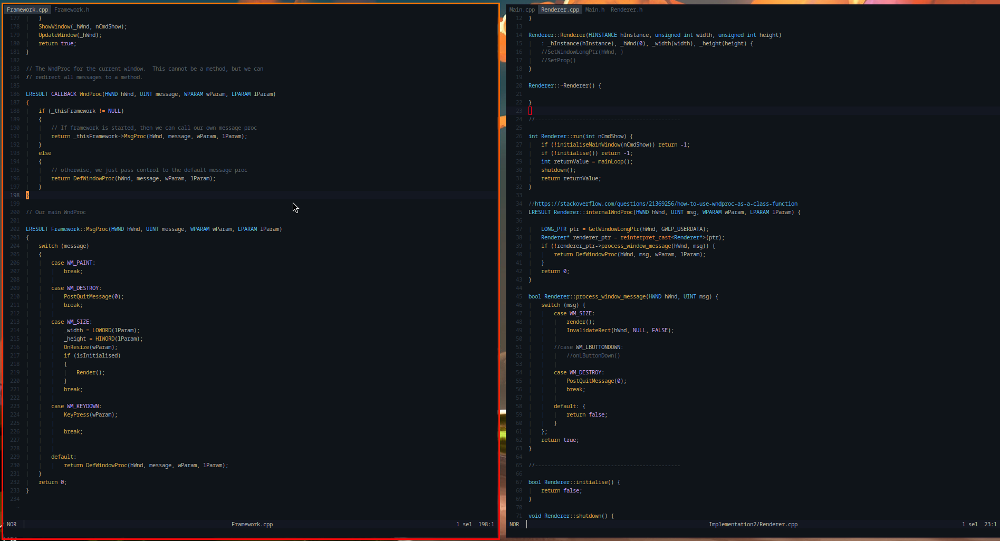

+++
title = "DirectX Uni"

[taxonomies]
tags = ["CPP", "Graphics", "University"]

[extra]
img = "icon.png"
date = "2022"
+++

"Graphics 1" university module learning DirectX 11. There's nothing too much here
outside of course content with the final assessment being a demonstration of standard
Blinn-Phong lighting and a basic scene graph.

{{ youtube(id="aO8zsbYcrlQ", autoplay=false) }}

{{ youtube(id="sQBKHE6Gvc4", autoplay=false) }}

The only thing of mine to really note was the university provided a DirectX project
template which setup and window and DirectX context for us. I wanted to create my own
version to get an understanding of how the project was structured and what did what.

While I never got far enough in to implement shaders and actually see it work, it still
helped to get an understanding DirectX.
It also would have been ineligile for the assessment criteria requiring the provided code.

<figure>
  
  <figcaption>The Universities provided structure</figcaption>
</figure>

<figure>
  
  <figcaption>My own attepmted implementation</figcaption>
</figure>

<figure>
  
  <figcaption>
    Uni (left) vs Mine (right) main header file layout. I tried to include WndProc directly
    into my code as I didn't like the concept of having the main input loop outside of the 
    main class and couldn't understand why you wouldn't keep everything together.
     Also sorry about img size/formatting (css is still relatively new to me).
  </figcaption>
</figure>

<figure>
  
  <figcaption>
    Uni (left) vs Mine (right) main input loop with WndProc. The provided code uses a pointer
    in the global scope to the main class which I didn't really like which is why I wanted to
    see if I could remove that element however just adds a lot of complexity I didn't know
    enough about at the time.
  </figcaption>
</figure>
