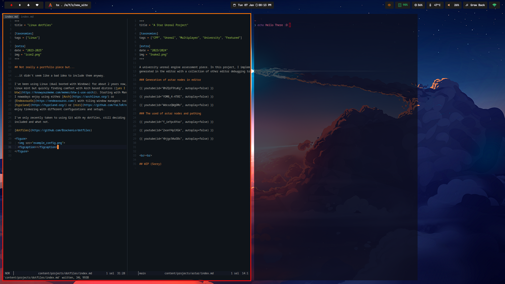

+++
title = "Linux dotfiles"

[taxonomies]
tags = ["Linux"]

[extra]
date = "2023-2025"
img = "icon2.png"
+++

## Not really a portfolio piece but...

...it didn't seem like a bad idea to include them anyway.

> p.s. [dotfiles are basically just configuration files](https://thelinuxcode.com/dotfiles-a-beginners-guide/)
(and not exclusive to Linux)

### Linux

I've been using Linux (dual booted with Windows) for about 2 years now, starting with
Linux mint but quickly finding comfort with Arch based distros ([yes I use arch
btw](https://knowyourmeme.com/memes/btw-i-use-arch)). Starting with Manjaro with KDE,
I nowadays enjoy using either [Arch](https://archlinux.org/) or
[EndeavourOs](https://endeavouros.com/) with tiling window managers such as
[hyprland](https://hyprland.org/) or [niri](https://github.com/YaLTeR/niri) and generally
enjoy tinkering with different configurations and setups.

I've only recently taken to using Git with my dotfiles, still deciding what should be
included and what not.

[dotfiles](https://github.com/BrackenLo/dotfiles)

<figure>
  
  <figcaption>Niri desktop environment on EndeavourOs</figcaption>
</figure>

