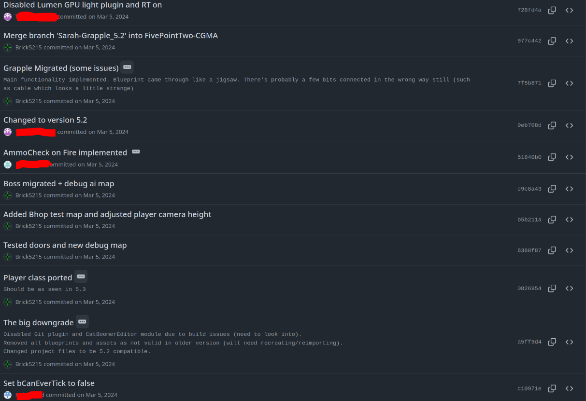

+++
title = "Mau"

[taxonomies]
tags = ["Unreal", "CPP", "Team Project", "University", "Featured"]

[extra]
date = "2024"
img = "logo.png"
+++

gameplay and editor footage + code snippets coming soon

# Introduction

Mau was our Derby University final year group project, spanning the second half of the academic year.

The lecturers decided to combine all of the Computer Games Programmers (CGP) and the Computer Graphics, 
Modelling, and Animation (CGMA) sudents into a single 'company', unlike previous years. As such, the team was
split into smaller sub-groups, each with a group lead. 

# The game

Mau is a [boomer shooter game](https://www.inverse.com/gaming/boomer-shooter-definition-origin) about the player
who had their cat stolen by aliens and ventures out to get them back.

It was initially created using Unreal Engine 5.3 however was later ported to Unreal Engine 5.2 due to issues with the
University lab computers.

Due to uncertainty with licensing issues with the University, I am unable to provide a copy of the game, its assets or
source code.

## Group leader

With some of the most programming experience, I was made a lead for a group of 6 other programmers.

Also as one of the only members with Git experience, I volunteered to setup, manage, and maintain a Github repository
while teaching Git to the other programmers and some of the CGMA students. Due to inexperience amongst programmers,
there were more than a few occasions that I had to completely rebuild branches or rebase or reset comits due to misuse
and misunderstanding.

And also as one of the only members with Unreal c++ experience, I assisted with teaching many of the CGP
students with writing various systems in c++ such as health management, gun systems, vehicle movement with splines, enemy
navigation with visualisation and more.

## Produced work

#### Base Enemy Class, AI Management Systems and AI Token System

At the start of the project, I helmed a lot of the base AI functionality while the rest of my team created the the AI
and functionality for the enemies. This included a base class for enemy characters, pawns and AI controllers as well as a
level game mode for monitoring AIs.

As a boomer shooter, we also decided to explore the idea of a [Doom like AI token system](https://youtu.be/2KQNpQD8Ayo?feature=shared&t=2502).
I implemented this into the level game mode alongside the monitoring systems, and into the base enemy ai controllers with
easy blueprint access. See the ai_director_gamemode header and class files below for the implementations but the essential
functionality was the gamemode would assign tokens to each player registered (we kept our options open for multiplayer early
on) and the each enemy, when planning to attack, would request a token. If obtained, could attack and if not, would do something
else.

While not ultimatly used in the final product, the implementation remained all the same.

> Most of this code was following the Epic Games c++ style however has since been through a formatter when porting here
which has altered line spacing, bracket placement, pointer and reference placement , etc.

 

{{ collapsible(text='Toggle "ai_director_gamemode.h') }}
{{ embed_code_block(language="c++", path="content/projects/mau/code/ai_director_gamemode.h") }}

{{ collapsible(text='Toggle "ai_director_gamemode.cpp') }}
{{ embed_code_block(language="c++", path="content/projects/mau/code/ai_director_gamemode.cpp") }}

 

{{ collapsible(text='Toggle "ai_director_resources.h') }}
{{ embed_code_block(language="c++", path="content/projects/mau/code/ai_director_resources.h") }}

{{ collapsible(text='Toggle "ai_director_resources.cpp') }}
{{ embed_code_block(language="c++", path="content/projects/mau/code/ai_director_resources.cpp") }}

 

{{ collapsible(text='Toggle "ai_enemy_base_controller.h') }}
{{ embed_code_block(language="c++", path="content/projects/mau/code/ai_enemy_base_controller.h") }}

{{ collapsible(text='Toggle "ai_enemy_base_controller.cpp') }}
{{ embed_code_block(language="c++", path="content/projects/mau/code/ai_enemy_base_controller.cpp") }}

 

{{ collapsible(text='Toggle "enemy_base_character.h') }}
{{ embed_code_block(language="c++", path="content/projects/mau/code/enemy_base_character.h") }}

{{ collapsible(text='Toggle "enemy_base_character.cpp') }}
{{ embed_code_block(language="c++", path="content/projects/mau/code/enemy_base_character.cpp") }}

 

{{ collapsible(text='Toggle "enemy_base.h') }}
{{ embed_code_block(language="c++", path="content/projects/mau/code/enemy_base.h") }}

 

{{ collapsible(text='Toggle "game_teams.h') }}
{{ embed_code_block(language="c++", path="content/projects/mau/code/game_teams.h") }}

{{ collapsible(text='Toggle "team_project_settings.h') }}
{{ embed_code_block(language="c++", path="content/projects/mau/code/team_project_settings.h") }}

{{ collapsible(text='Toggle "team_project_settings.cpp') }}
{{ embed_code_block(language="c++", path="content/projects/mau/code/team_project_settings.cpp") }}

 

Some of this code was written in a seperate editor module which added debugging and visualisation functionality to the
editor.

{{ collapsible(text='Toggle "patrol_component.h') }}
{{ embed_code_block(language="c++", path="content/projects/mau/code/patrol_component.h") }}

{{ collapsible(text='Toggle "patrol_component.cpp') }}
{{ embed_code_block(language="c++", path="content/projects/mau/code/patrol_component.cpp") }}

{{ collapsible(text='Toggle "patrol_visualizer.h') }}
{{ embed_code_block(language="c++", path="content/projects/mau/code/patrol_visualizer.h") }}

{{ collapsible(text='Toggle "patrol_visualizer.cpp') }}
{{ embed_code_block(language="c++", path="content/projects/mau/code/patrol_visualizer.cpp") }}

#### Boss prototype

Written in blueprint to show off ideas for boss ideas. Initial prototype included attacks for missiles,
mortars, laser spin, ground pound/knockback, and a charge.

#### Health Components

#### Second game level

I had worked quite closely alongside some of the CGMA level designers and was interested in the process of
designing a level. As such, I spent a few evenings creating my own level using existing assets from one of
the previous levels. When shown off, the level was accepted into the roster, passing into the hands of the
level designers to be tailored, passing back to me on occasion.

When initially designing the level, I used a very organized folder structure for all of the walls, floors,
ceilings, and other props, all grouped again by section of the map. This approach was later used by some of
the other level designers on their own levels.

## Downgrading Unreal Engine

I spent more than a few hours working with University tech support across my last year due to University lab
systems not compiling Unreal Engine c++ code. It was eventually discovered that in UE 5.3, compilation uses
and edits some files found in the installation directory on the university c drive which students didn't have
permission to edit.

Due to this discovery, we were forced to convert about a months worth of project work from UE 5.3 to 5.2.
We found that Unrealy engine files aren't backwards compatible, every asset, level and blueprint in the editor 
gone after the change. While I found some ways that we could edit the file in a hex editor to get them to work,
it would be just as tedious as re-creating everything and could cause incompatibility issues later.

As such, myself and one of the other CGMA leads spent a couple of days porting all of the assets, levels and
blueprints to 5.2 so that the programmers could use c++ in the labs.

<figure>
  
  <figcaption>Start on work change form 5.3 to 5.2</figcaption>
</figure>

  

## WIP (Sorry)
