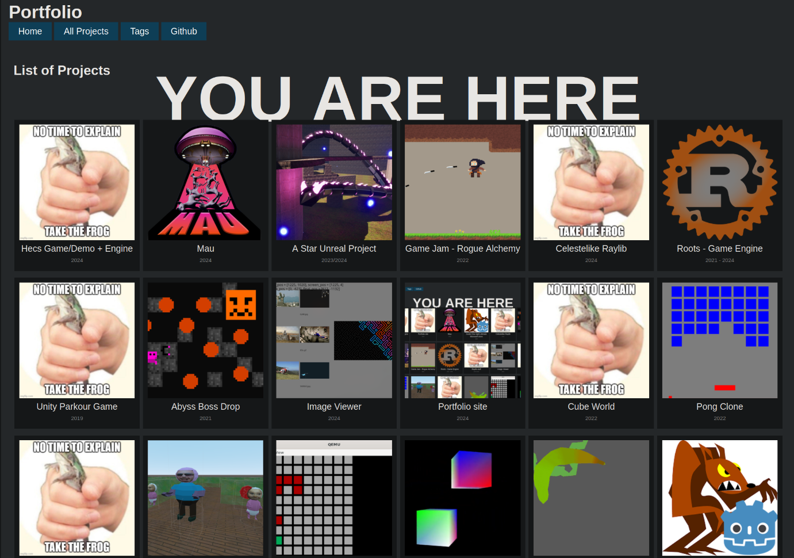

+++
title = "Portfolio site"

[taxonomies]
tags = ["Web"]

[extra]
date = "2024"
img = "icon.png"
+++

[Find the code here](https://github.com/BrackenLo/portfolio_zola)

[And the built site here](https://github.com/BrackenLo/BrackenLo.github.io)


# You are here already

This is a statically generated site using the [zola static site engine](https://www.getzola.org/).

I've used Zola once previously a few years ago and it is written in Rust so maybe I am a little biased
but it does mean that if anything goes wrong, I have a higher chance of being able to fix it (and I
also should have all of its dependencies and toolchains already if needed). 

> **p.s**. No Rust was written in the making of this project. Just Html, Css, and Markdown

While Zola [does provide templates](https://www.getzola.org/themes/), I felt like I needed something more
specific/tailored and so created this site from scratch.

Html and Css are not languages i've spent a lot of time with in the past and so this site is a little bit
of a crash course in how you probably shouldn't design a website but I have done anyway. In the future I
might include toggles for light themes and stuff but it's not really needed right now.

The bulk of the Html goes through the [Tera template engine](https://www.getzola.org/themes/) which is
relatively easy to use but finding whether it has certain features or not and then implementing them was
a little difficult sometimes. 

projects_list.html
``` html





  <div class="intro_block">
    <h1 class="title">
      {{ section.title }}
    </h1>
  </div>

  <div class="tiles_block">
    <div class="tile_area">
      
        
      
    <div>
  </div>


```

tile.html
```html

  

  

  




  
  


<div class="tile">
  <a href="{{ page.permalink | safe }}">
    <figure>
      
      <figcaption>{{ page.title }}</figcaption>
      
        <figcaption class="date">{{ page.extra.date }}</figcaption>
      
      
    </figure>
  </a>
</div>
```

<br><br>

### Yes I did take multiple screenshots for this thumbnail (even if it's too small to notice on the projects page)



<br>

