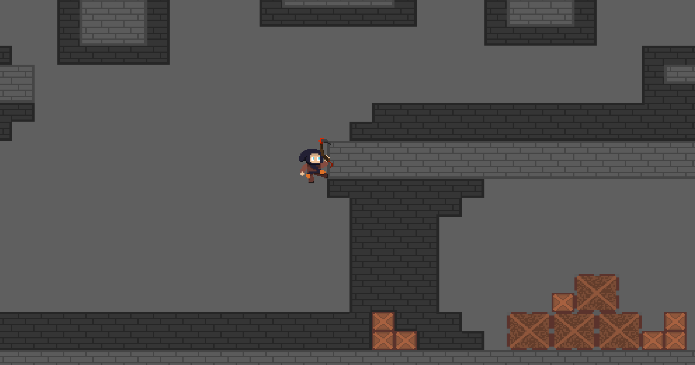
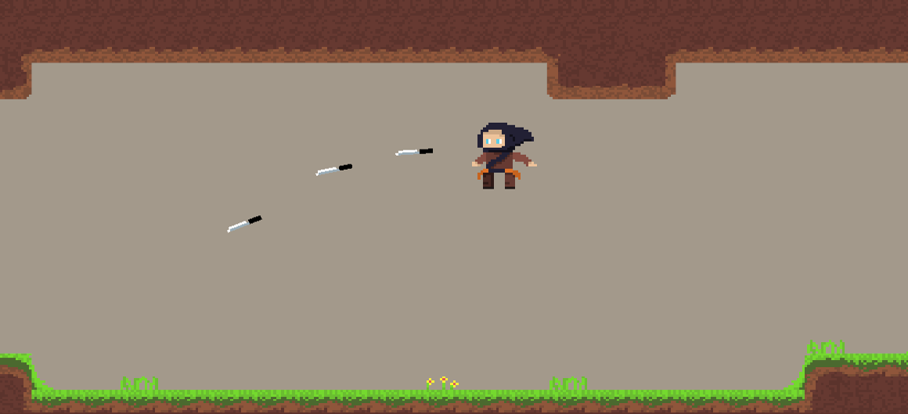
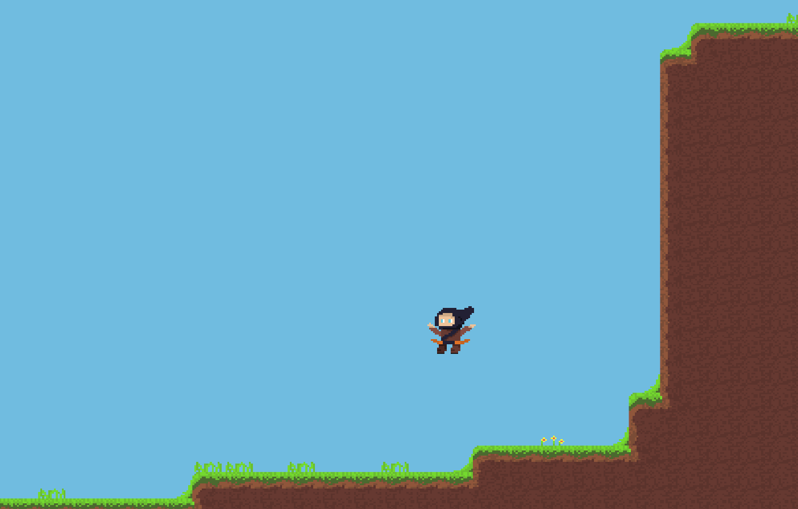

+++
title = "Game Jam - Rogue Alchemy"

[taxonomies]
tags = ["Rust", "Bevy", "Game Jam"]

[extra]
date = "2022"
img = "img2.png"
+++

[Find the code here](https://github.com/Brick5215/bevy_metroidvania_gamejam)

Made for the 2022 Metroidvania Month 15 Game Jam. [Find the project page here](https://benjamin5215.itch.io/stars-of-rogue).

My First proper project using the [Bevy Game Engine](https://bevyengine.org/). As a relatively new and
developing engine, both now and back in 2022, creating a game in Rust while

  

## TODO (Sorry)
