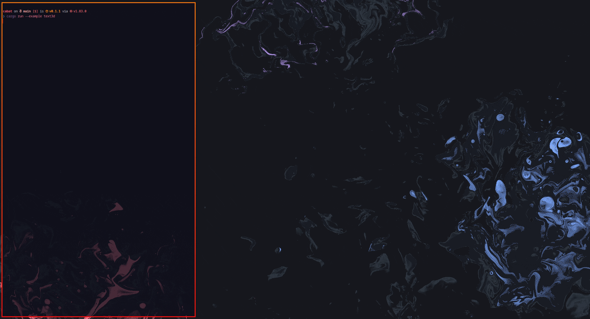

+++
title = "Roots - Game Engine"

[taxonomies]
tags = ["Rust", "Wgpu", "Graphics", "Featured", "Web"]

[extra]
date = "2021 - 2024"
img_static = "rust_logo.png"
+++

[Find the code here](https://github.com/BrackenLo/roots)

# What is Roots?

Roots is the current culmination of two to three years of learning Rust with Wgpu. While still missing features present
in previous projects, my goal with Roots is to be used in any of my future projects, being the roots that they may stem 
from.

Over the years of discovering, learning and tinkering with both the concepts of low level graphics, Wgpu and Rust, I've
found myself reinventing the wheel time and time again in the search for the best way to implement features.

Roots is different from my previous projects listed below as it is what many of them should have been from the start.
Previous attempts to create a library for use in multiple projects kept turning into full on game engines, handling many
of the core required feature such as rendering, physics, asset loading.

While I am very pleased with these works, they were not compatible with all the projects I wanted to work on and at times
made implementing new features incredibly complicated. As such, I've tried to make Roots independant from functionality
not suitable for all projects (e.g. Entity Component Systems and game loops) and be fairly easy to extend and expand.

 

### Most of my previous engines/versions

These repos are all projects that implement the Wgpu library themselves, implementing all functionality for rendering.

Please note that the latest commit for some of these repos may not be in working states.

| Date    | Project                                             | Repo                                                    | Description
| ------- | --------------------------------------------------- | ------------------------------------------------------- | ----------------------------------------------------------------------
| nov 24  | [hecs_engine](@/projects/hecs-game/index.md)        | [repo](https://github.com/BrackenLo/hecs_engine)        | A more traditional game engine, provinding the used a 'state' each from that can be used to manipulate the engine
| nov 24  | turnbase                                            | [repo](https://github.com/BrackenLo/turnbase_0)         | A turnbased game using sprites and text in 3d space.
| oct 24  | feathered                                           | [repo](https://github.com/BrackenLo/feathered)          | A remaster of cabat with additional features such as GJK physics.
| sept 24 | cabat                                               | [repo](https://github.com/BrackenLo/cabat)              | An attepted expandable library turned [ECS](https://github.com/leudz/shipyard) based game engine. Used to make [image viewer](@/projects/image-manager/index.md).
| aug 24  | [ik_creatures_v1](@/projects/ik-creatures/index.md) | [repo](https://github.com/BrackenLo/ik_creatures)       | The first version of inverse kinematic creatures used Wgpu seperately
| apr 23  | roots_old                                           | [repo](https://github.com/BrackenLo/brackens_roots_old) | My first proper game engine - provides seperate functionality in modules
| july 22 | [pong clone](@/projects/notpong/index.md)           | [repo](https://github.com/BrackenLo/not_pong)           | One of my first projects learning Wgpu - unfinished
| apr 22  | [cube worlds](@/projects/cube-world/index.md)       | [repo](https://github.com/BrackenLo/cube_worlds)        | One of my first projects learning Wgpu - unfinished

 

#### Some gifs of stuff from cabat (just not implemented with roots yet)

<figure>
  
  <figcaption>Text rendering inspired by the Glyphon crate (just with a focus on 3d)</figcaption>
</figure>

<figure>
  
</figure>

#### A gif of stuff from feathered

<figure>
  
  <figcaption>Creating a turn based game has been on my todo list for a long time. Doing it in 3d is a tempting but difficult prospect.</figcaption>
</figure>

## The Rust Langauge - Why Rust?

I have a love/hate relationship with the Rust language. It's a really nice language to write in. It's really easy to setup
projects, write and debug and when your code compiles, your program usually just works. As well as a bunch of other stuff
like first class support for features other languages like C++ have tacked on.

However, it's promise of memory and thread safety is also great and saves so many headaches you might have in other languages
while causing so many headaches you wouldn't have in other languages. The inability to access, store or alter references to
variables makes actually making games much harder and is why the Entity Component System paradigm is so common in Rust.

There's a saying or a joke in the Rust community along the lines of "why are there so many game engines written in Rust but 
hardly any games?" and it's easy to see why. Rust is great for making robust, fast systems but when you need the freedom to
just throw variables around, have mutable and immutable references across multiple parts of your code, it's much more difficult.

There's a reason why C/C++ is the undisputed champion of game development and I find myself longing for it more frequently and
wanting to continue graphics programming with something like OpenGL or Vulkan. Unfortunatly past and current experiences with
the C build tools such as cmake make it harder to get started.

 

## Web Assembly

Back onto the fun stuff, Rust has first class support for Web Assembly and as such, Roots was made with the option of making
web builds from the start. It's one of the reasons the [IK Creatures](@/projects/ik-creatures/index.md) demo is available even
if the web support needs a little more work.

  

# WIP (sorry)
